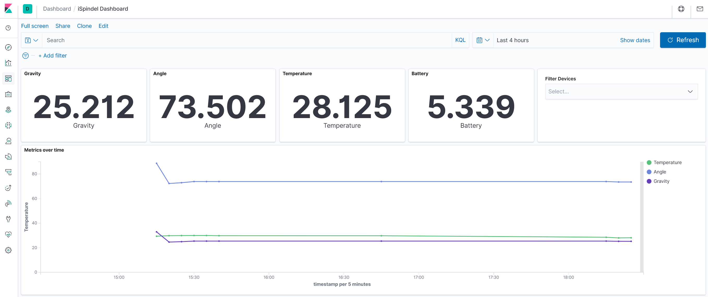
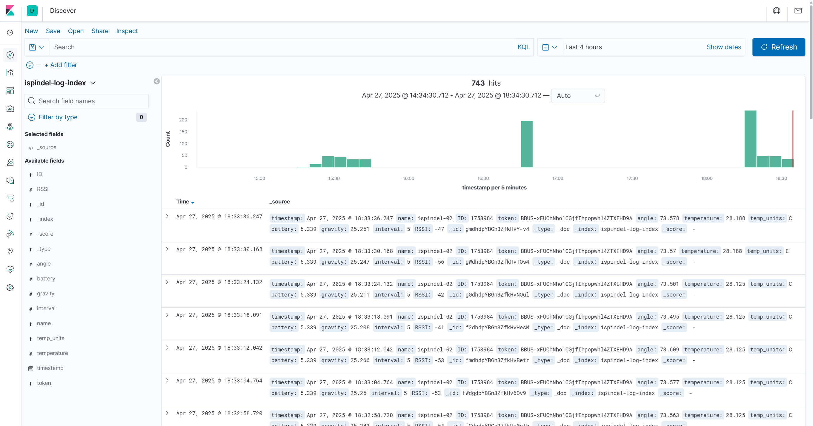
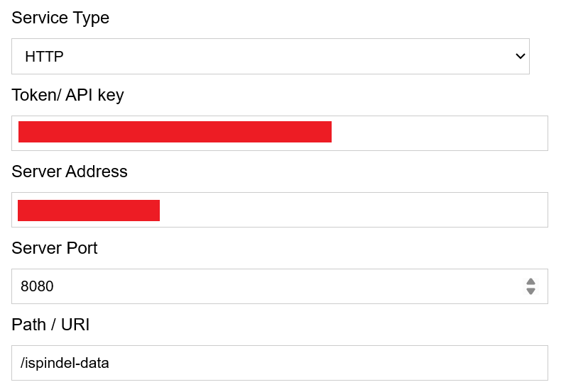

# iSpindel Data

This is an easy way to self-host, collect and view iSpindel data.



## Install

Copy `.env.example` to `.env` and configure iSpindel server port e.g. 8080

```
docker-compose build
docker-compose up

# or daemon mode
docker-compose up -d
```

Wait a few minutes for everything to initialise.


## Check Installation

Replace localhost and port with that of the computer hosting the docker instances.

Navigate to http://localhost:8080/health and you should see 'ok'.

Navigate to http://localhost:9200/_cat/health and you should see some text with 100%.

Navigate to http://localhost:5601/api/status and you should see some json data.

⚠️ Don't proceed until you have full health using the previous links ⚠️


## Configure Kibana Dashboard

Access Kibana here http://localhost:5601/app/kibana

Navigate to http://localhost:8080/test to submit a test iSpindel packet to elasticsearch/kibana.

Navigate to http://localhost:5601/app/kibana#/management/kibana/index_pattern to create and configure a new index.

1. Enter index pattern `ispindel-log-index` and click 'Next step'
2. Select `timestamp` for time filter field name and click 'Create index pattern'

Your test data record should appear in the 'Discover' section.




### Import Kibana dashboard and visualisations

1. Navigate to Manage -> Saved Objects -> Import
2. Import `./kibana/kibana-export.ndjson` file from this repo
3. Navigate to Dashboard -> iSpindel Dashboard


## Configure iSpindel

Configure iSpindle with your ispindel-data app's network ip and port:

```
Service Type: HTTP
Server Address: 192.168.x.y
Server Port: 8080
Path / URI: /ispindel-data
```



## Caution

In production consider storing the elasticsearch filesystem somewhere safe with data redundancy in mind.
No user credentials are configured for kibana/elasticsearch so be careful.


## Todo

* Add token authentication for iSpindel devices
* Custom login credentials for elasticsearch/kibana
